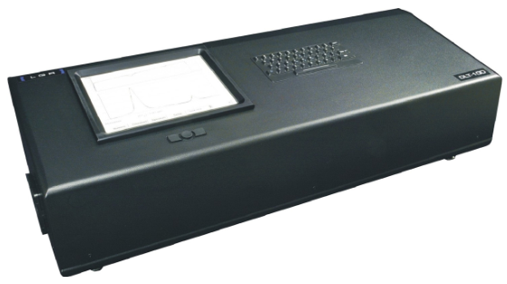
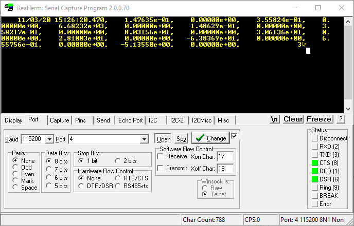

# Los Gatos Research N<sub>2</sub>O/CO Analyzer (benchtop DLT-100)

Protocol for reading data streamed by serial (RS-232) from a
[Los Gatos Research N2O/CO Analyzer](http://losgatosresearch.com/analyzers/overview.php?prodid=20).



## Serial Port Configuration

> *Note: a null modem adapter or null modem cable is required.*

Recommended configuration for analyzer:

- Baud rate: `115200`
- Parity: `None`
- Stop Bits: `1`
- Time Stamp: `Absolute Local American: mm/dd/yyyy, hh:mms:ss.ssss`
- Delimiter: `Comma` (required for proper data parsing)
- Rate = N: `2`

> *Testing suggests N=1 is too fast for reliable data parsing, resulting in zero values
> or values which are off by an order of magnitude (x10 or x100 more).*

Corresponding serial port setup in DAQFactory:

- Baud rate: `115200`
- Byte size: `8`
- Parity: `None`
- Stop bits: `1`
- Timeout: `1000` msec
- Flow Control: `None`

## Protocol File

The user device protocol file ([`pLGR_N2O_CO.ddp`](pLGR_N2O_CO.ddp))
breaks out almost all of the data into individual channels. At this time, 
diagnostic values are not included.

### I/O Types

Users can select from the following device `I/O Types` in DAQFactory. There is
no need to set `D#`, `Chn #` or `Timing` since these values are ignored.
Data acquisition rate is controlled by the serial output rate of the analyzer.

- Ambient temperature (Celsius)
- Cell pressure (Torr)
- Cell temperature (Celsius)
- CO (ppb)
- CO (dry ppb)
- H2O (ppm)
- N2O (ppb)
- N2O (dry ppb)
- *Standard error (SE) values for each of the above*

### Example Document

An minimalistic example control document is available [here](LGR_N2O_CO_protocol.ctl)
for testing and development purposes. It contains only 7 channels and page elements
that are suitable for opening with DAQFactory Express. Be sure to update the
device COM port value to match your system.

## Notes

1. Units for N2O & CO values are converted to parts per billion (ppb); this is
   a significant difference from data in files retrieved directly from the analyzer,
   which use parts per million (ppm).
2. Ignore the serial port documentation in the user manual - it contains errors.

Example serial port data record:



Sample data from internal data file indicating position and units:

````
                     Time,       [CO]_ppm,    [CO]_ppm_se,      [N2O]_ppm,   [N2O]_ppm_se,      [H2O]_ppm,   [H2O]_ppm_se,   [CO_dry]_ppm,[CO_dry]_ppm_se,  [N2O_dry]_ppm,[N2O_dry]_ppm_se,      GasP_torr,   GasP_torr_se,         GasT_C,      GasT_C_se,         AmbT_C,      AmbT_C_se,         LTC0_v,      LTC0_v_se,           AIN5,        AIN5_se,         DetOff,      DetOff_se,       Fit_Flag
    07/31/20 12:05:32.661,    1.35674e-01,    0.00000e+00,    2.95422e-01,    0.00000e+00,    1.17530e+04,    0.00000e+00,    1.37288e-01,    0.00000e+00,    2.98936e-01,    0.00000e+00,    8.02193e+01,    0.00000e+00,    3.69579e+01,    0.00000e+00,    3.52880e+01,    0.00000e+00,   -1.22077e+03,    0.00000e+00,    6.53717e-01,    0.00000e+00,   -1.00000e+01,    0.00000e+00,              3
    07/31/20 12:05:33.654,    1.35043e-01,    0.00000e+00,    2.92720e-01,    0.00000e+00,    1.15715e+04,    0.00000e+00,    1.36624e-01,    0.00000e+00,    2.96147e-01,    0.00000e+00,    8.02354e+01,    0.00000e+00,    3.69448e+01,    0.00000e+00,    3.54070e+01,    0.00000e+00,   -1.22077e+03,    0.00000e+00,    6.54770e-01,    0.00000e+00,   -1.00000e+01,    0.00000e+00,              3
    07/31/20 12:05:34.645,    1.35083e-01,    0.00000e+00,    2.92398e-01,    0.00000e+00,    1.15099e+04,    0.00000e+00,    1.36656e-01,    0.00000e+00,    2.95802e-01,    0.00000e+00,    8.02555e+01,    0.00000e+00,    3.69351e+01,    0.00000e+00,    3.55126e+01,    0.00000e+00,   -1.22077e+03,    0.00000e+00,    6.55816e-01,    0.00000e+00,   -1.00000e+01,    0.00000e+00,              3
    07/31/20 12:05:35.637,    1.35197e-01,    0.00000e+00,    2.92490e-01,    0.00000e+00,    1.14939e+04,    0.00000e+00,    1.36769e-01,    0.00000e+00,    2.95891e-01,    0.00000e+00,    8.02483e+01,    0.00000e+00,    3.69399e+01,    0.00000e+00,    3.54808e+01,    0.00000e+00,   -1.22078e+03,    0.00000e+00,    6.55329e-01,    0.00000e+00,   -1.00000e+01,    0.00000e+00,              3
    07/31/20 12:05:36.627,    1.35121e-01,    0.00000e+00,    2.92368e-01,    0.00000e+00,    1.15006e+04,    0.00000e+00,    1.36693e-01,    0.00000e+00,    2.95769e-01,    0.00000e+00,    8.02462e+01,    0.00000e+00,    3.69389e+01,    0.00000e+00,    3.55006e+01,    0.00000e+00,   -1.22078e+03,    0.00000e+00,    6.55705e-01,    0.00000e+00,   -1.00000e+01,    0.00000e+00,              3
    07/31/20 12:05:37.619,    1.35063e-01,    0.00000e+00,    2.92283e-01,    0.00000e+00,    1.15009e+04,    0.00000e+00,    1.36635e-01,    0.00000e+00,    2.95684e-01,    0.00000e+00,    8.02530e+01,    0.00000e+00,    3.69384e+01,    0.00000e+00,    3.55046e+01,    0.00000e+00,   -1.22078e+03,    0.00000e+00,    6.55650e-01,    0.00000e+00,   -1.00000e+01,    0.00000e+00,              3
    07/31/20 12:05:38.608,    1.35092e-01,    0.00000e+00,    2.92328e-01,    0.00000e+00,    1.15176e+04,    0.00000e+00,    1.36666e-01,    0.00000e+00,    2.95734e-01,    0.00000e+00,    8.02544e+01,    0.00000e+00,    3.69386e+01,    0.00000e+00,    3.55093e+01,    0.00000e+00,   -1.22078e+03,    0.00000e+00,    6.55660e-01,    0.00000e+00,   -1.00000e+01,    0.00000e+00,              3
    07/31/20 12:05:39.604,    1.35177e-01,    0.00000e+00,    2.92461e-01,    0.00000e+00,    1.15070e+04,    0.00000e+00,    1.36751e-01,    0.00000e+00,    2.95866e-01,    0.00000e+00,    8.02364e+01,    0.00000e+00,    3.69461e+01,    0.00000e+00,    3.54253e+01,    0.00000e+00,   -1.22078e+03,    0.00000e+00,    6.54884e-01,    0.00000e+00,   -1.00000e+01,    0.00000e+00,              3
````
