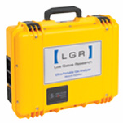
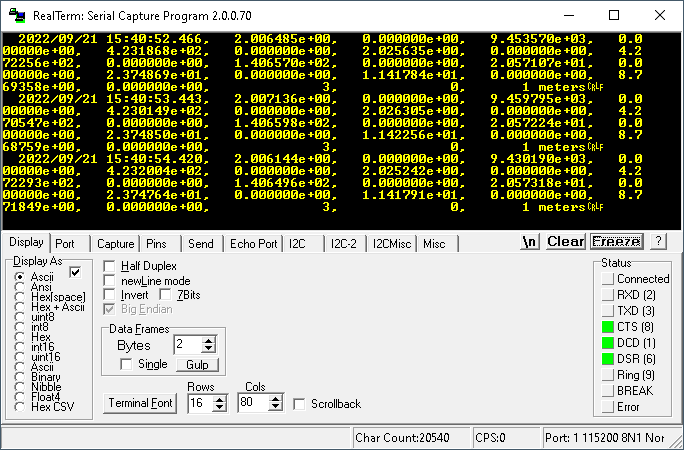

# Los Gatos Research UGGA (CO<sub>2</sub>, CH<sub>4</sub>, H<sub>2</sub>O)

Protocol for reading data streamed by serial (RS-232) from a Los Gatos Research
[Ultraportable Greenhouse Gas Analyzer (UGGA)](http://www.lgrinc.com/analyzers/ultraportable-greenhouse-gas-analyzer/)
(CO<sub>2</sub>/CH<sub>4</sub>/H<sub>2</sub>O).



## Serial Port Configuration

> *Note: a null modem adapter or null modem cable is required.*

Recommended configuration for analyzer:

- Serial Output
    - Baud rate: `115200`
    - Parity: `NONE`
    - Stop bits: `1`

Corresponding serial port setup in DAQFactory:

- Baud rate: `115200`
- Byte size: `8`
- Parity: `None`
- Stop bits: `1`
- Timeout: `1000` msec
- Flow Control: `None`

## Sequence

A basic looped sequence for listening to incoming data and parsing messages into
data channels is demonstrated in example files linked below. For compatibility
with DAQFactory Express, the example sequence only stores 8 data channels.

If a serial data message is received but appears to be invalid (i.e. `Fit_Flag`
value is not "`3`") then an error message is displayed in the alert window.
All other errors are silently ignored.

- [Example sequence-based .CTL document](LGR_UGGA_sequence.ctl)
- [Contents of DAQ sequence](sequence.txt)
- [Importable channel definitions](channels.txt)

> *N.B. the sequence is part of the DAQFactory control document and any changes
> made remain exclusive to that control document. There are advantages and
> disadvantages to this approach.*

### DAQFactory Device Setup

- Quick > Device Configuration > New Serial (RS232/RS485) / Ethernet (TCP/IP) device
- Device Name: `LGR_UGGA` [*failure to use this device name will result in errors*]
- Serial Port > New Serial (RS232/422/485)
   - Connection Name: `LGR_UGGA`
   - Serial port # (COM): `1` [*update to match your computer*]
   - Baud: `115200`
   - Byte size: `8`
   - Parity: `None`
   - Stop bits: `1`
   - Timeout: `1000` msec
   - Flow control type: `None`
- Protocol
   - `NULL protocol`
- Channels [*channel names must match exactly or errors will occur*]
   - UGGA_CH4
   - UGGA_CH4_dry
   - UGGA_CO2
   - UGGA_CO2_dry
   - UGGA_H2O
   - UGGA_amb_T
   - UGGA_cell_T
   - UGGA_cell_P

### Sequence Data Variables

The following variables are parsed and stored by the example sequence. Expanding
the sequence to parse additional data from the serial message is relatively
straightforward.

| Channel Name | Description | Units |
|:-------------|:------------|:-----:|
| UGGA_CH4     | Methane mixing ratio | ppm |
| UGGA_CH4_dry | Methane (dry) mixing ratio | ppm |
| UGGA_CO2     | Carbon dioxide mixing ratio | ppm |
| UGGA_CO2_dry | Carbon dioxide (dry) mixing ratio | ppm |
| UGGA_H2O     | Water vapor | ppm |
| UGGA_amb_T   | Ambient temperature | Celsius |
| UGGA_cell_T  | Sampling cell temperature | Celsius |
| UGGA_cell_P  | Sampling cell pressure | Torr |

## Protocol File

The user device protocol file ([`pLGR_UGGA.ddp`](pLGR_UGGA.ddp)) exposes
all available data variables. Instead of dealing with sequences and channel
names, the individual variables are exposed as device I/O Types. Users can
choose which variables to record and apply their own channel naming convention.

> *N.B. the protocol file is not stored with DAQFactory control documents and
> must be installed on each machine where the document will be opened. There
> are advantages and disadvantages to this approach.*

### I/O Types

Users can select from the following device `I/O Types` in DAQFactory. The `D#`
must be `0`. Both `Chn #` and `Timing` columns are ignored. Data acquisition rate
is controlled by the serial output rate of the analyzer.

- CH4 (ppm)
- CH4 (dry ppm)
- CO2 (ppm)
- CO2 (dry ppm)
- H2O (ppm)
- Cell Pressure (Torr)
- Cell Temperature (Celsius)
- Ambient Temperature (Celsius)
- Ringdown 0 (usec)
- Ringdown 1 (usec)
- *Standard deviation (SD) values for each of the above*
- Fit Flag
- MIU Valve
- MIU Description
- Status

The additional `Status` I/O type contains device-related alerts and messages
from DAQFactory (not from the analyzer). When using the sequence-based approach
described above, these messages are displayed in the alert window instead.

### Example Document

An example control document is available [here](LGR_UGGA_protocol.ctl) for
testing and development purposes. It contains only 8 channels and page elements
that are suitable for opening with DAQFactory Express. Be sure to update the
device COM port value to match your system.

## Notes

Example serial port data record:



Sample data from internal data file indicating position and units:

````
                     Time,      [CH4]_ppm,   [CH4]_ppm_sd,      [H2O]_ppm,   [H2O]_ppm_sd,      [CO2]_ppm,   [CO2]_ppm_sd,     [CH4]d_ppm,  [CH4]d_ppm_sd,     [CO2]d_ppm,  [CO2]d_ppm_sd,      GasP_torr,   GasP_torr_sd,         GasT_C,      GasT_C_sd,         AmbT_C,      AmbT_C_sd,         RD0_us,      RD0_us_sd,         RD1_us,      RD1_us_sd,       Fit_Flag,      MIU_VALVE,       MIU_DESC
  2020/08/22 14:22:55.041,   2.516521e+00,   1.765319e-02,   6.421611e+03,   1.313648e+02,   9.160974e+02,   7.770845e+00,   2.532787e+00,   1.808083e-02,   9.220191e+02,   7.938097e+00,   5.815302e+01,   7.888044e-03,   3.496863e+01,   3.554908e-03,   3.675370e+01,   2.909002e-02,   1.171666e+01,   2.761883e-03,   8.987200e+00,   3.246087e-03,              3,              0,       1 meters
  2020/08/22 14:23:04.813,   2.528455e+00,   2.839803e-03,   6.817953e+03,   1.270557e+02,   9.239648e+02,   1.268735e+00,   2.545813e+00,   2.949093e-03,   9.303077e+02,   1.368966e+00,   5.808599e+01,   3.103670e-02,   3.497201e+01,   4.989445e-04,   3.678854e+01,   6.417364e-03,   1.171645e+01,   3.315847e-03,   8.985692e+00,   2.197036e-03,              3,              0,       1 meters
  2020/08/22 14:23:14.579,   2.534325e+00,   7.755065e-03,   7.232022e+03,   7.719016e+01,   9.281050e+02,   2.992387e+00,   2.552787e+00,   7.862727e-03,   9.348661e+02,   3.049056e+00,   5.794768e+01,   3.072794e-02,   3.497328e+01,   3.490946e-04,   3.679925e+01,   2.816491e-03,   1.171687e+01,   3.068409e-03,   8.985499e+00,   2.291019e-03,              3,              0,       1 meters
  2020/08/22 14:23:24.350,   2.581579e+00,   3.102632e-02,   7.144349e+03,   2.120211e+02,   9.432548e+02,   8.632262e+00,   2.600150e+00,   3.070913e-02,   9.500406e+02,   8.498950e+00,   5.790768e+01,   4.147354e-02,   3.497631e+01,   1.274070e-03,   3.681269e+01,   3.121978e-03,   1.171536e+01,   2.609127e-03,   8.983838e+00,   3.506840e-03,              3,              0,       1 meters
  2020/08/22 14:23:34.119,   2.663612e+00,   2.027952e-02,   6.897224e+03,   8.468093e+01,   9.591466e+02,   2.419873e+00,   2.682110e+00,   2.024153e-02,   9.658079e+02,   2.368128e+00,   5.799254e+01,   3.091904e-02,   3.498012e+01,   1.288446e-03,   3.682415e+01,   3.497712e-03,   1.171622e+01,   2.514915e-03,   8.984751e+00,   2.682890e-03,              3,              0,       1 meters
  2020/08/22 14:23:43.886,   2.752114e+00,   3.442168e-02,   6.956251e+03,   2.534469e+02,   9.704613e+02,   4.769151e+00,   2.771400e+00,   3.534560e-02,   9.772604e+02,   5.031339e+00,   5.802056e+01,   5.328379e-02,   3.498279e+01,   1.069039e-03,   3.682553e+01,   2.491387e-03,   1.171455e+01,   3.125478e-03,   8.983504e+00,   1.808952e-03,              3,              0,       1 meters
````
